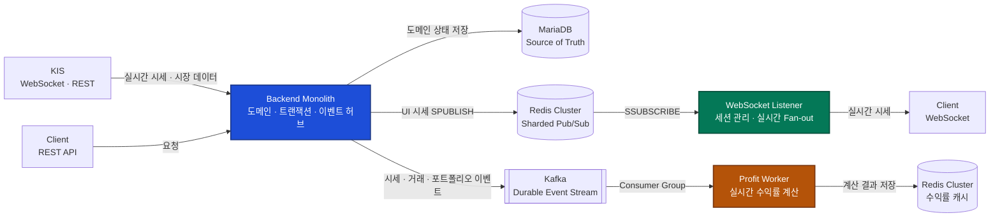

# Finvibe Backend Monolith

> 모의 투자 플랫폼 Finvibe의 **핵심 비즈니스와 트랜잭션을 처리하고, 실시간 시장 이벤트를 목적별 파이프라인으로 분배하는 중심 서버**입니다.

Java 21과 Spring Boot 4 기반의 모듈형 모놀리스입니다. 인증, 시장 정보, 포트폴리오, 거래, 지갑, 게이미피케이션, 콘텐츠와 학습 도메인을 하나의 일관된 모델로 관리하면서, 자원 특성이 다른 WebSocket 전송과 실시간 수익률 계산은 독립 서버로 분리했습니다.

## 아키텍처



Profit Worker가 Redis에 저장한 계산 결과는 수익률 조회 요청을 처리할 때 Monolith가 사용합니다.

## 관련 저장소

| 저장소 | 역할 |
|---|---|
| [Backend Monolith](https://github.com/DEPth-FinVibe/Finvibe_Backend_Monolith) | 핵심 도메인 API, 트랜잭션, KIS 시세 수신과 이벤트 발행 |
| [WebSocket Listener](https://github.com/DEPth-FinVibe/Finvibe-Websocket-Listener) | Redis 시세 이벤트를 구독해 WebSocket 클라이언트에 전달 |
| [Profit Worker](https://github.com/DEPth-FinVibe/Finvibe_Backend_Profit_worker) | Kafka 이벤트를 소비해 포트폴리오·유저 수익률을 계산 |
| [Backend Manifest](https://github.com/DEPth-FinVibe/Finvibe_Backend_Manifest) | Kubernetes 리소스와 ArgoCD 기반 배포 상태 관리 |

## 왜 별도 서버로 분리했는가

Monolith에는 강한 일관성이 필요한 핵심 비즈니스 규칙과 트랜잭션을 모았습니다. 반면 실시간 전송과 수익률 계산은 요청 처리와 자원 사용 패턴이 달라 독립적으로 확장하고 장애를 격리할 수 있도록 분리했습니다.

| 분리한 책임 | Monolith에서 분리한 이유 | 연결 방식 |
|---|---|---|
| WebSocket 세션과 시세 Fan-out | 수천 개의 장기 연결과 순간적인 전송 부하가 REST API의 스레드·메모리와 경쟁하지 않도록 격리 | Redis Cluster Sharded Pub/Sub |
| 실시간 수익률 재계산 | 가격 변동마다 발생하는 계산·Redis I/O가 API 응답 시간과 트랜잭션을 지연시키지 않도록 비동기화 | Kafka Consumer Group |

Redis Pub/Sub 경로는 **낮은 지연과 최신 시세 전달**에 집중합니다. Kafka 경로는 **이벤트 내구성, 배압, 재처리**가 필요한 수익률 계산을 담당합니다. 같은 가격 이벤트라도 목적에 맞는 전달 방식을 선택했습니다.

## Monolith가 담당하는 역할

### 1. 핵심 비즈니스 API

인증과 회원, 시장 정보, 포트폴리오, 거래, 지갑, 게이미피케이션, 뉴스·토론·학습 기능의 REST API를 제공합니다. 서로 밀접한 도메인을 한 애플리케이션 안에 두어 기능 간 흐름을 명시적인 모듈 경계로 연결합니다.

### 2. 트랜잭션과 원본 데이터 관리

매수·매도, 자산과 현금 잔액 변경처럼 함께 성공하거나 실패해야 하는 작업을 하나의 로컬 트랜잭션으로 처리합니다. 영속 도메인 상태는 MariaDB를 Source of Truth로 두고, Redis는 조회 성능과 실시간 파이프라인을 위한 캐시·인덱스로 사용합니다.

### 3. 실시간 시장 데이터 수신

KIS WebSocket과 REST API를 통해 실시간 시세와 시장 데이터를 수신합니다. 여러 인스턴스가 실행되어도 Redis 기반 credential 할당, 구독 소유권과 분산 락을 이용해 외부 API 연결과 종목 구독을 조정할 수 있도록 구성했습니다.

### 4. 목적별 이벤트 발행

수신한 현재가를 저장한 뒤 사용 목적에 따라 두 경로로 분배합니다.

- 화면에 즉시 보여줄 시세는 Redis Cluster의 Sharded Pub/Sub으로 발행합니다.
- 수익률 계산과 상태 변경 이벤트는 Kafka에 발행해 독립적인 Worker가 처리하게 합니다.

Monolith는 비즈니스 이벤트의 발생 지점과 계약을 소유하고, 전송과 계산의 실행 책임은 각 서버에 위임합니다.

## 수평 확장 전략

세 애플리케이션 서버는 인스턴스 간 공유가 필요한 상태와 조정 수단을 외부 인프라에 두어 **인스턴스를 추가하는 방식으로 수평 확장할 수 있도록 설계**했습니다. WebSocket 세션처럼 연결에 종속된 상태만 각 Listener 인스턴스가 소유합니다.

| 서버 | 스케일 아웃 단위 | 다중 인스턴스 조정 방식 |
|---|---|---|
| Monolith | REST API 처리량과 KIS 연결 | Kubernetes Service를 통한 요청 분산, Redis 분산 락·구독 소유권·credential 할당, ShedLock 기반 스케줄 조정 |
| WebSocket Listener | 동시 WebSocket 연결과 Fan-out 처리량 | 로드 밸런서가 연결을 인스턴스별로 분산하고 각 인스턴스가 Redis Sharded Pub/Sub 시세를 구독 |
| Profit Worker | Kafka 이벤트 처리량 | Consumer Group이 파티션을 인스턴스에 분배하고 lag에 맞춰 Worker를 추가 |

현재 Kubernetes Manifest에는 Monolith 1개, WebSocket Listener 3개, Profit Worker 3개의 replica가 선언되어 있습니다. 이는 현재 배포값이며 설계상 확장 가능 범위와는 구분됩니다. Profit Worker의 유효 병렬도는 Kafka 파티션 수, Monolith의 KIS 연결 규모는 증권사 credential과 구독 한도의 영향을 받습니다.

## 모듈형 모놀리스

코드베이스는 도메인별 패키지와 port/adapter 경계로 나뉩니다. 배포 단위는 하나지만 각 기능의 책임과 의존 방향을 분리해 변경 영향 범위를 제한합니다.

| 모듈 | 책임 |
|---|---|
| `market` | KIS 연동, 종목·현재가·차트·시장 상태 |
| `asset`, `trade`, `wallet` | 포트폴리오 자산, 주문·체결, 현금 잔액 |
| `user` | 인증, OAuth2, 회원 관리 |
| `gamification` | 챌린지, 배지, 경험치, 스쿼드 |
| `news`, `discussion`, `study` | 금융 콘텐츠, 커뮤니티, 경제 학습과 AI 추천 |

## 기술 스택

- Java 21, Spring Boot 4, Spring MVC, Spring Data JPA
- MariaDB, Redis Cluster, Apache Kafka
- Kubernetes, ArgoCD, GitHub Actions
- Micrometer, Prometheus, Grafana, Loki

## 로컬 실행

```bash
# MariaDB, Redis, Kafka 등 로컬 인프라 실행
docker compose -f infra/docker-compose.yml up -d

# 애플리케이션 실행
./gradlew bootRun
```
